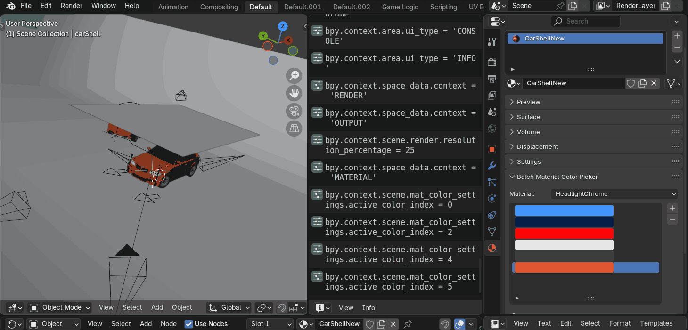

# BatchColorRenderer
 This is a Blender add-on that allows for easy automated batch rendering of multiple color variations of the same material.

## Example Usage

  

## Example Results from one Batch Render

  
  
  
  
  
  

